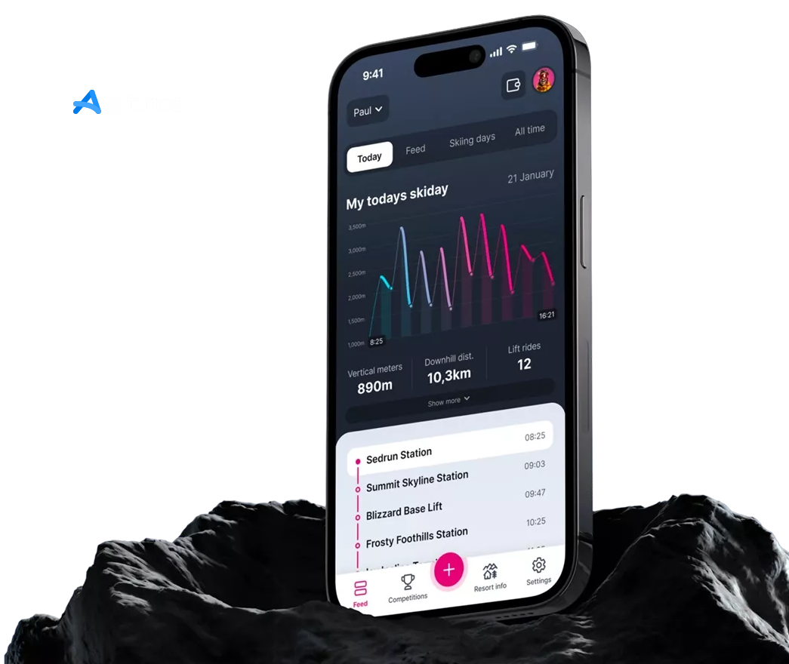
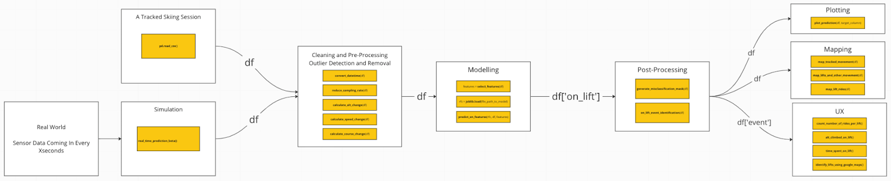
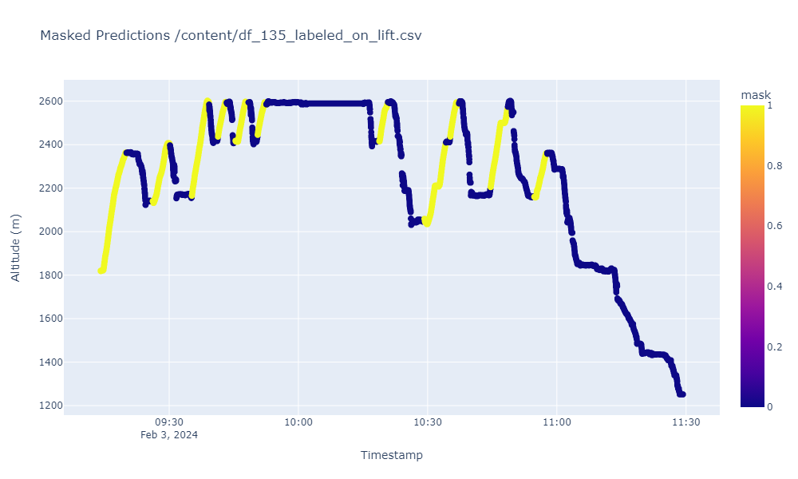
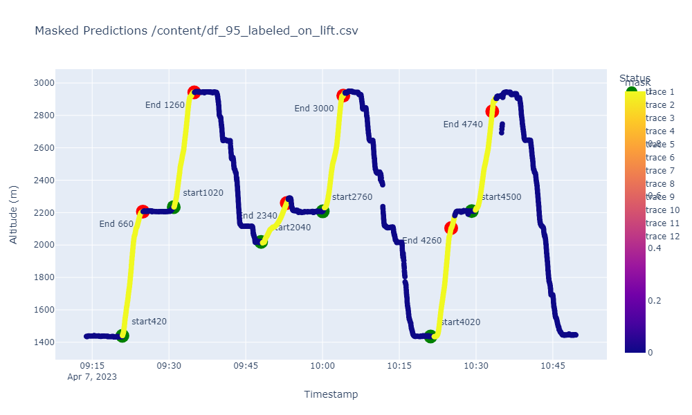

# Alturos Project

## General Project Abstract

This project aimed to develop a machine learning algorithm capable of interpreting sensor data from skiers' mobile devices to accurately identify whether or not they are on a ski lift and if so identify which ski-lifts they are using in order to expand the capabilities of the Alturos [Skiline](https://www.alturos.com/en/skiline/) app.
  
This involved real-time data simulation, 
development of ML prediction models, and utilization of clustering algorithms to analyze and categorize lift events.

## Authors
- [Tosin Aderanti](https://www.linkedin.com/in/oluwatosin-a-79551a87/)
- [Paul Biesold](https://www.linkedin.com/in/paul-biesold/)
- [Raphael Penayo Schwarz](https://www.linkedin.com/in/raphael-penayo-schwarz-586b65167/)
- [Sebastian Rozo](https://www.linkedin.com/in/engiineer-sebastian-rozo/)

## Supervisors
- Gilberto Loaker - Alturos Chariman of the Board
- Ekaterina Butyugina - Constructor Academy PM
- Stephanie Sabel - Constructor Academy TA

## Approach
- Incoming data
    - Utilized sensor data from mobile devices from two different apps: 
        - [Sensor Logger](https://apps.apple.com/us/app/sensor-play-data-recorder/id921385514) for iOS devices
        -  [Sensors Toolbox](https://play.google.com/store/apps/details?id=com.kelvin.sensorapp&hl=en&gl=US) for Android devices
- Data management
    - To train our models effectively, we utilized labeled data for supervised machine learning from 12 different sessions and two geographical locations
    - Datasets were then prepared by incorporating outlier detection and engineered features to maximize predictive performance.
- Modeling
    - Explored various machine learning models, prioritizing accuracy metrics.
    - Selected Random Forest Classifier as the most suitable model.
- Post processing
    - Misclassification handling:
        - Achieved a 96% accuracy rate with our Random Forest Classifier (RFC) model. Through the implementation of post-processing strategies, we enhanced the continuity of classified events and minimized misclassifications. These refinements contribute to a more consistent user experience and improve overall accuracy.

    - On-lift event detection:
        - Engineered "on-lift" event detection for consolidating continuous lift activities.
    - Google API integration:
        - Integrated Google API for fetching lift names and their respective locations.
    - Clustering algorithm development:
        - Devised a clustering algorithm for grouping lift rides based on their origin and destination points.
- UX development
    - Plotting and mapping of ski lift events.
    - Generated real time prediction simulation and visualization
    - Lift statistics generation:
        - Generated statistical insights, summaries, and devised strategies for database management related to lift activities.

## Requirements
- Python environments with necessary libraries found in requirements.txt.
- App to track data (if new data is to be captured and analized)

## How to Work with the Alturos AlpineSync Repository
- Environment: Create an environment by installing the dependencies from the requirements.txt file. This will allow you to run all the notebooks and be able to analyse data and create predictions. 
- App: You can run and test the app showcasing our results [AlpineSync App](https://alpinesync.streamlit.app/)
- Folders: 
    - App: Find all necessary scripts for the app. 
    - Data: This includes images for the app, readme as well as raw and labelled data for training and testing the model. Moreover, this includes the lifts_db for naming lifts. 
    - Models: Find all our trained Random Forrest Classifier algorithms in here. You can import them easily using the Joblib library. 
   - Notebooks: Find all relevant Jupyter Notebooks on labelling data, training and testing a RFC, reformatting new data, as well as the full data pipeline which is at work inside of our app. Please note that these notebooks feature many inline comments explaining the logic. Moreover, you will find insights into other practices we have been doing during this project. 

__Data Pipeline Schematic__

## Potential next steps 
- Train and test models on more data from different regions
try pipeline with real time data input (no simulation )
- Improve machine learning algorithm for lift differentiation using Google Maps API

## Sample Results
- Streamlit app link 
- Real-time lift identification accuracy metrics.
- Examples of clustering outcomes for on-lift and off-lift events.
- Visualization of ski-lift usage over time. 
- "on lift" event recognition. 

